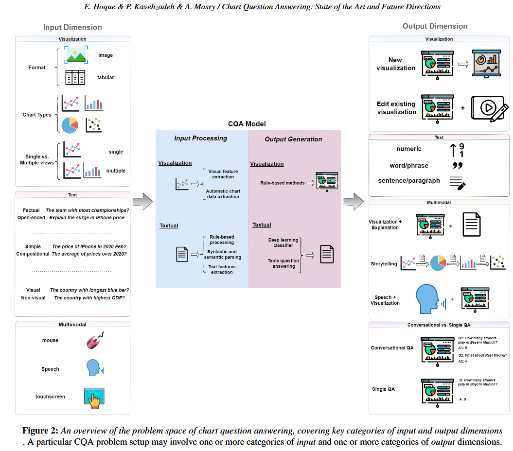

# **Reflection 10**
# Title: Chart Question Answering: State of the Art and Future Directions (EUROVIS 22)
Authors: 

E. Hoque1 and P. Kavehzadeh1 and A. Masry

Intelligent Visualization Lab, York University, Toronto, Canada

1. [Chart Question Answering: State of the Art and Future Directions](https://arxiv.org/pdf/2205.03966.pdf)

**Paper's Contribution:** 

**Abstract**: Information visualizations such as bar charts and line charts are very common for analyzing data and discovering critical
insights. Often people analyze charts to answer questions that they have in mind. Answering such questions can be challenging
as they often require a significant amount of perceptual and cognitive effort. Chart Question Answering (CQA) systems typically
take a chart and a natural language question as input and automatically generate the answer to facilitate visual data analysis.
Over the last few years, there has been a growing body of literature on the task of CQA. In this survey, we systematically
review the current state-of-the-art research focusing on the problem of chart question answering. We provide a taxonomy by
identifying several important dimensions of the problem domain including possible inputs and outputs of the task and discuss
the advantages and limitations of proposed solutions. We then summarize various evaluation techniques used in the surveyed
papers. Finally, we outline the open challenges and future research opportunities related to chart question answering.

# **Major Takeaways**

- The paper outlines overview of current stata and future directions of Chart Question Answering (CQA) Systems.
- Underscores the importance of CQA systems that facilitates interaction with chart data using natural language questoins. (Especially someone that is less technical or analytical)
- The Figure above clearly outlines the input and output dimension in a manner that future research can tackle opportunities highlighted. 
- Benchmark Datasets for evaluation: This is particulary important for researchers looking for widely used and accepted dataset for the research. 

**References:**

1. [Chart Question Answering: State of the Art and Future Directions](https://arxiv.org/pdf/2205.03966.pdf)
