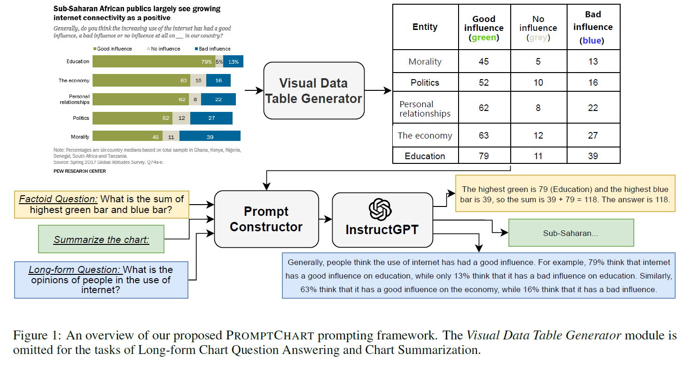

# **Reflection 11**
# Title: Do LLMs Work on Charts? Designing Few-Shot Prompts for Chart Question Answering and Summarization
Authors: 

Xuan Long Do, Mohammad Hassanpour, Ahmed Masry, Parsa Kavehzadeh, Enamul Hoque, Shafiq Joty

1. [Do LLMsWork on Charts? Designing Few-Shot Prompts for Chart Question Answering and Summarization](https://arxiv.org/abs/2312.10610)

**Paper's Contribution:** 

**Abstract**: A variety of tasks have been proposed recently to facilitate exploration and analysis of charts such as chart QA and summarization. The dominant paradigm to solve these tasks has been to fine-tune a pretrained model on the task data. However, this approach is not only expensive but also not generalizable to unseen tasks. On the other hand, large language models (LLMs) have shown impressive generalization capabilities to unseen tasks with zero- or few-shot prompting. However, their application to chart-related tasks is not trivial as these tasks typically involve considering not only the underlying data but also the visual features in the chart image. We propose PROMPTCHART, a multimodal few-shot prompting framework with LLMs for chart-related applications. By analyzing the tasks carefully, we have come up with a set of prompting guidelines for each task to elicit the best few-shot performance from LLMs. We further propose a strategy to inject visual information into the prompts. Our experiments on three different chart-related information consumption tasks show that with properly designed prompts LLMs can excel on the benchmarks, achieving state-of-the-art.

# **Major Takeaways**

- This method is mainly focused on Chart Question Answering and Summarization tasks.
- The paper introduces PROMPTCHART, a multimodal few-shot prompting framework with LLMs for chart-related applications.
- The paper outlines the guidelines for designing few-shot prompts, where the model is given a small number of examples to learn from, rather than undergoing extensive retraining for chart question answering and summarization.
- The paper also proposes a strategy to inject visual information into the prompts where generation of visual data tables represent the chart's data along with its visual attributes
- Results show that with properly designed prompts, including the integration of visual information, LLMs can achieve state-of-the-art performance on benchmarks for chart-related tasks.

**References:**

1. [Do LLMsWork on Charts? Designing Few-Shot Prompts for Chart Question Answering and Summarization](https://arxiv.org/abs/2312.10610)
