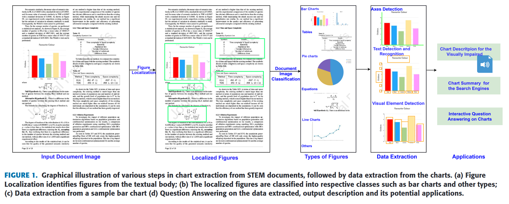

# **Reflection 13**
# Title: Data Extraction and Question Answering on Chart Images Towards Accessibility and Data Interpretation
Authors: 

SHAHIRA K C (Graduate Student Member, IEEE), PULKIT JOSHI, AND LIJIYA A (Member, IEEE)

1. [Data Extraction and Question Answering on Chart Images Towards Accessibility and Data Interpretation](https://xplorestaging.ieee.org/ielx7/8782664/10016900/10302417.pdf?arnumber=10302417)

**Paper's Contribution:** 

**Abstract**: Graphical representations such as chart images are integral to web pages and documents.
Automating data extraction from charts is possible by reverse-engineering the visualization pipeline. This
study proposes a framework that automates data extraction from bar charts and integrates it with question-
answering. The framework employs an object detector to recognize visual cues in the image, followed by
text recognition. Mask-RCNN for plot element detection achieves a mean average precision of 95.04% at
a threshold of 0.5 which decreases as the Intersection over Union (IoU) threshold increases. A contour
approximation-based approach is proposed for extracting the bar coordinates, even at a higher IoU of 0.9. The
textual and visual cues are associated with the legend text and preview, and the chart data is finally extracted
in tabular format. We introduce an extension to the TAPAS model, called TAPAS++, by incorporating new
operations and table question answering is done using TAPAS++ model. The chart summary or description
is also produced in an audio format. In the future, this approach could be expanded to enable interactive
question answering on charts by accepting audio inquiries from individuals with visual impairments and do
more complex reasoning using Large Language Models.

# **Major Takeaways**

Contributions of the paper:
- The paper presents techniques that implements object detection for localizing all the chart components and performs text extraction and recognition from the image.
- Paper propers novel algorithm for bounding box approximation of the bars is introduced.
- The process involves identifying the chart elements and text localization, which is achieved using MASK-RCNN.
- The visual and textual elements detected are associated with the legends, and the data is extracted into a table format.
- Question answering on the extracted data is accomplished using the TAPAS model. An extension to the TAPAS called TAPAS++ is introduced for more advanced reasoning on charts.

- Future works could explore the potential of artificial intelligence for multi-modal question answering on charts, enabling interactive question answering on charts by accepting audio inquiries from individuals with visual impairments.

**References:**

1. [Data Extraction and Question Answering on Chart Images Towards Accessibility and Data Interpretation](https://xplorestaging.ieee.org/ielx7/8782664/10016900/10302417.pdf?arnumber=10302417)
